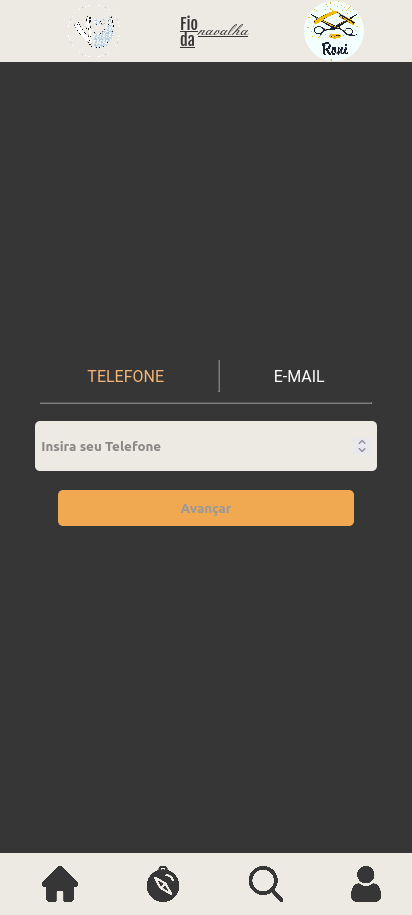
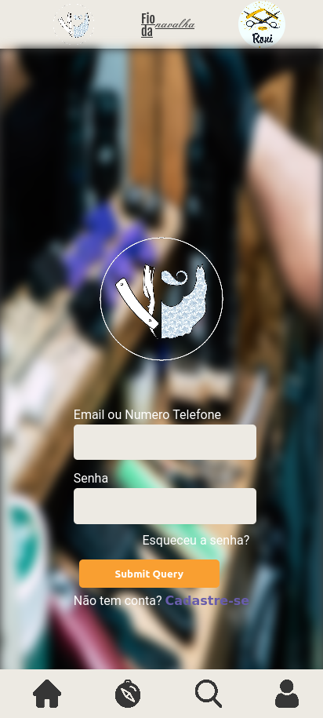
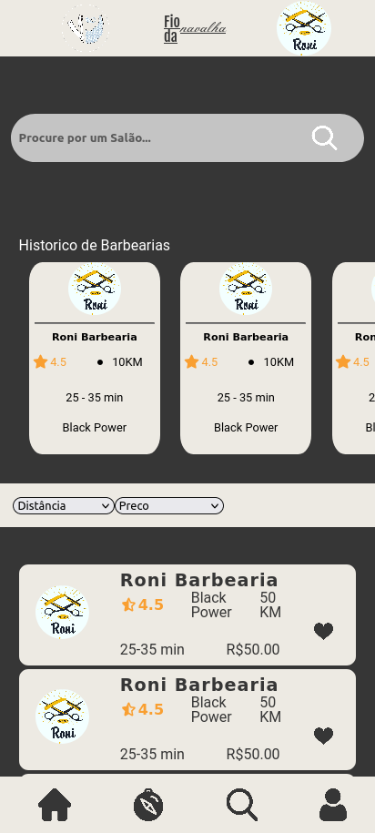

# Fio da Navalha
Repositorio que irá conter todo o código-fonte do frontend que será exibido no Projeto: Fio da Navalha

## Sobre:
Este serviço irá exibir todas as Paginas para os usuarios, sendo que os dados serão consumidos do microservico [Backend](https://github.com/LuccasTraumer/tcc-srv-fio-navalha). Este que foi também desenvolvido e implementado pelos mesmos desenvovedores, utilizando a Linguagem Java na sua versão 11 com o Framework Spring Boot e como MVP 1 para utilizamos o um Banco de Dados Não Relacional (NoSQL).
Adotamos este Banco pois seria mais facil de iniciar o projeto mas para um MVP 2 iremos mudar para um Banco Relacional que possivelmente será o SQL Server. Entendendo o negocio como um todo ter relacionamento entre as entidades faz mas sentido.

## Ferramentas e Linguagens:
Este Projeto está sendo Desenvolvido com o framework Frontend Angular 2.x, pois para proximas entregas disponibilizar a versão desktop.
Angular foi escolhido por ser um Framework com uma comunidade imensa com muito conteudo para se estudar e debater sobre. E também pois não precisariamos desenvolver 3 apĺicações diferentes (Desktop, IOS e Android), por isso adotamos uma SPA para agilizar no desenvolvimento e para termos um menor retrabalho possivel.

Utilizamos o Gitflow para nos orientar no Versionamento de Codigo e Deployamos com a Vercel. [Acesse Aqui](https://tcc-fed-fio-navalha-pcajw0lw5-luccastraumer.vercel.app/#/):

- ### Ferramentas Utilizadas no Desenvolvimento do Projeto:
  Sobre as Ferramentas utilizadas no Projetos tentamos, centralizar para que não houvesse muitas "falhas" por não sabermos onde está, coisas necessaria.
  Por exemplo utilizamos o Github para centralizar todas parte de Controle de Codigo(CSV) mas também o utilizamos uma das features recentes da plataforma para o desenvolvimento Agil com boards kanban, sendo assim podemos linkar nossos cards com o projeto que vai ser desenvolvido este card. E também com esse modelo utilizamos ao criarmos Pull Request(PR) ele automaticamente linka quais cards estão sendo incluidos em uma determinada branch(ramificação).
  Outra feature "recente" disponibilizada é a de Integração Continua(CI) e Entrega Continua(CD), onde no Github Actions configuramos para que em determinada branch, ele execute o build do projeto, execute os testes e caso estes dois passos ocorrerem com sucesso, irá acontecer o deploy da aplicação na Vercel, com isso conseguimos ver nosso projeto no ar rapidamente.
  Entao não temos medo de errar em Produção, pois caso aconteça um erro, basta voltarmos uma versão no Git ou subir um corretiva o quanto antes.

  Desenvolvemos nos baseando nas [boas praticas da comunidade Angular](https://angular.io/guide/lazy-loading-ngmodules) e também nos basenado um dos livros mais conhecido no mundo do desenvolvimento de software que é o [Clean Code](https://balta.io/blog/clean-code).

  Pré-desenvolvimento utilizamos o [Figma](https://www.figma.com/) para o desenvolvimento do Layout inicial.

  **FERRAMENTAS** | ***LINK*** |
  ------------|--------
   Github Actions (Automatização do CI e CD) | https://github.com/LuccasTraumer/tcc-fed-fio-navalha/actions |
   Github Projects(Kanban) | https://github.com/users/LuccasTraumer/projects/1  |
   Figma | https://www.figma.com/ |
   Discord | https://discord.com/ |
   Google Cloud Plataform | https://cloud.google.com/ |
   Github |
   Git |

  - ### Linguagens e Frameworks:
  - #### **FRONTEND:**
    - Angular 2.x
    - Typescript 4.0.1
    - ECMASCRIPT 6
    - Jest
    - Vercel
    - API Server
  - #### **BACKEND:**  
    - Spring Boot
    - MongoDB
    - Java 11
    - JUnit 5
    - Mockito
    - Postman

  ### Qualidade:
  - Para Qualidade de Codigo, utilizamos o Jest como framework de teste para o frontend na cobertura dos testes unitarios.
  - Para o backend utilizamos o JUnit e o Mockito.

## Telas do Projeto:
Pagina de Login (MVP 1):

  
   
  

***Pensado, Implementado e testado por:***

Nome        | RA | LINKEDIN
------------|-----|---------
Lucas Jesus | 19372| https://www.linkedin.com/in/lucassjesus/
Pedro Otavio | 19382| https://www.linkedin.com/in/pedro-candido-445548199/
Pedro Henrique | 20366| https://www.linkedin.com/in/pedro-henrique-114b111aa/
